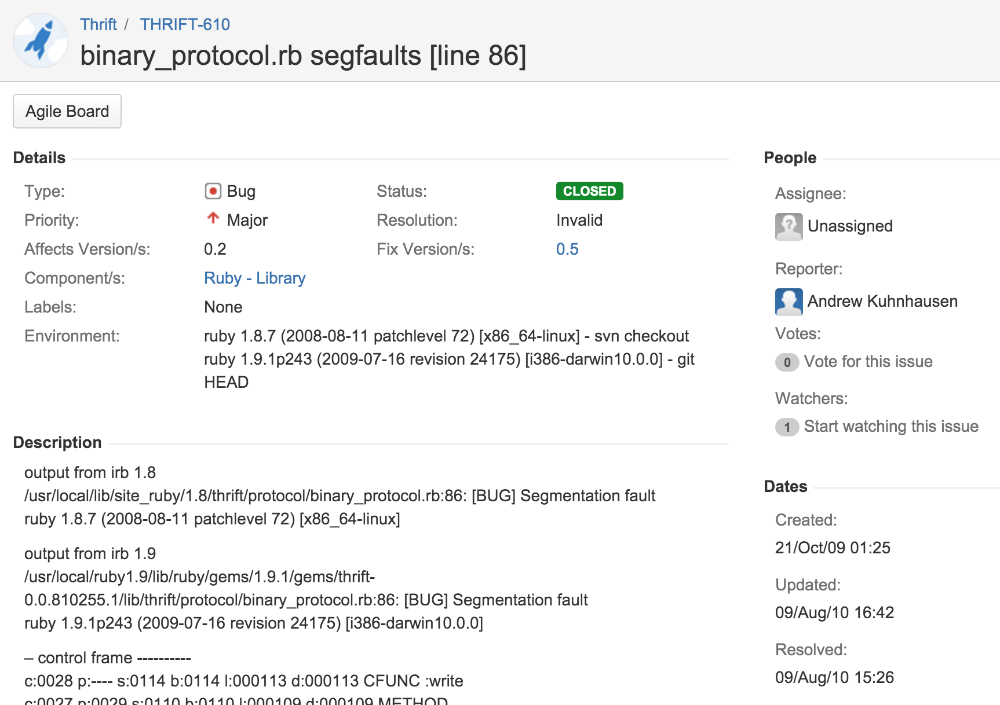

# open source

### icanhazcommunity?
#### andrew kuhnhausen - hackbright mar 18th 2016
##### @kuhnhausen | github.com/trane | blog.errstr.com

---

# agenda

---

## what's an open source?

---

## why open source?

---

## how to open source?

---

## do stuff for realzies!

---

## !(!q || !a)

---

# /me

---

# /me

## ask yourself what you can do for the company

* Engineer at 
* Started Functional Programming study groups
* Diversity Committee
* Work on functional infrastructure
** compilers, interpreters, and code generators
** validations of distributed systems
** automate the world

---

# /me

## hand waving about post-neo-classical datastructures

* Static Analysis of Dalvik Bytecode for Malware Detection
* University of Utah, advisor: Matt Might

---

# /me

## et cetera, etc, and more!

* spent most of my life pursuing music as a career
* morei no brasil, falo português
* my cat is amazing
* his name is sphinx
* he sounds like a new york taxi cab driver when he meows

---

# what?
### (OSS o.pen s.ource s.oftware)

---

## belongs to everyone

---

## be used, read, and modified freely

---

# oss licenses

Apache License 2.0
BSD 3-Clause "New" or "Revised" license
BSD 2-Clause "Simplified" or "FreeBSD" license
GNU General Public License (GPL)
GNU Library or "Lesser" General Public License (LGPL)
MIT license
Mozilla Public License 2.0
Common Development and Distribution License
Eclipse Public License

---

# different than closed source

---

## closed or open - you can't infer
### quality
### security
### scalability
### maintainability

---

# examples
## operating systems
## languages
## databases
## libraries
## frameworks

---

# operating systems
## linux
## (free, net, open)bsd
## ... and more

---

# languages
## python, scala, ruby, javascript
## ... and more

^ technically, javascript is not open source, but implementations like v8 and
spidermonkey are and the ecmascript is really the language specification

---

# languages
## python, scala, ruby, javascript
## ... and more

technically it's not javascript, it's ecmascript.
and ecmascript is actually an open standard, not code
but, javascript engines like V8 and SpiderMonkey are open source!

---

## some oss i use at work

---

# languages
## nix, scala, ruby, bash, javascript, thrift, protobufs

---

# services
## cassandra, kafka, mysql, sqlite, redis, memcached, nginx, apache

---

# frameworks and os
## linux, nixops, openssl, gerrit, nvim, chef, jenkins, finagle, sinatra, sidekiq, storm

---

# why?

---

## power and fear

^ for all of our history people have been using the access to knowledge as means to oppress and keep power

---

## lone wolf
## (aka hero)

^ they have you believe that they are heroes or god-like in their abilities,
like they accomplished it all on their own

---

## code is infrastructure

^ just like the freeway system and water ways, it enables more innovation and
more opportunity

---

## giving back

^ when you added a feature or fixed something, don't keep it to yourself - give
it back
^ i'm sure many of you modified a library to allow you to move forward with
your project, did you give it back to the original author of the library?

---

## if it's useful to you, it's probably useful to someone else

^ when you write something, make it available - even if you feel it's silly or
trivial -- who knows who will find it useful

---

# how?
## (contributing)

---

* blog and do code review
* write bug reports or fix the bugs
* implement features
* write and update documentation
* improve tests
* ask questions in irc or gitter
* attend/host meetups and conferences
* encourage coworkers and friends

---

## my first open source contribution

---

## my code contributions over the last year

---

# how?
## (owning)

---

## don't ask
### "should i make this open source?"

---

## instead ask
### "why should i not make this open source?"

---

## make your code public
### (recommend github)

---

## add an oss license
### (recommend mit)

---

## make sure your README is good
### (look at other well-regarded libraries)

---

## include a code of conduct
### (use a community one)

---

## set up your chat
### (gitter and/or irc)

---

## announce it
### (twitter is great for this)

---

## keep working at it
### (give talks, sell it, use it)

---

# time to try

---

# look at the issue backlog

---

# fork it
### https://github.com/trane/thirteeneer

---

# clone it
### git clone https://github.com/:youruser/thirteeneer.git

---

# create an issue/feature branch
### git checkout -b CoC

---

# add the code of conduct
### git add .

---

# write a good commit message
### git commit

---

# good commit messages
### http://chris.beams.io/posts/git-commit/

---

---

# push to your repo and branch
### git push origin CoC

---

# create a pull request

---

# review pull request

---

# merge pull request

---

# create a gitter channel

---

# obrigado

### @kuhnhausen | github.com/trane | blog.errstr.com

---

