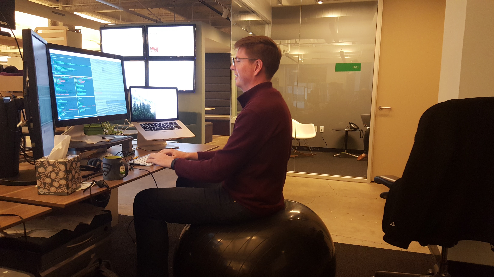
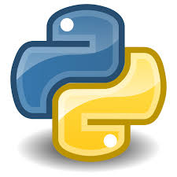
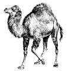

# open source

### icanhazcommunity?
#### Andrew Kuhnhausen - Hackbright Dec 14th 2015
##### @kuhnhausen | github.com/trane | blog.errstr.com

---

# agenda

---

## wat's an open source?

---

## why open source?

---

## how do i open source?

---

## how do you open source?

---

## !(!q || !a)

---

# /me

## ask yourself what you can do for the company

* Engineer at 
* Started Functional Programming study groups
* Diversity Committee
* Work on functional infrastructure
** compilers, interpreters, and code generators
** validations of distributed systems
** automate the world

---

# /me

## hand waving about post-neo-classical datastructures

* Static Analysis of Dalvik Bytecode for Malware Detection
* University of Utah, advisor: Matt Might

---

# /me

## et cetera, etc, and more!

* spent most of my life pursuing music as a career
* joined Twitter a few months ago because I was giving a talk at their conference
* joined Facebook 3 week ago, 'cause i'm not telling
* my cat is amazing, his name is Sphinx, and he sounds like a new york taxi cab driver when he meows.

---

# /me

## ...and i'm one of Blake's mentors

---

# /me

## ...sorry Blake, i'm just so proud!

---

# wat's an open source
### (OSS o.open s.ource s.oftware)

---

### code that belongs to everyone

---

# examples
## operating systems
## languages
## databases
## libraries
## frameworks

---

# operating systems
## linux
## (free, net, open)bsd
## ... and more

---

# languages
## python, scala, ruby, perl, javascript, racket
## ... and more

---

## OSS i use at work

---

# languages
## nix, scala, ruby, bash, javascript, thrift, protobufs

---

# services
## cassandra, kafka, mysql, sqlite, redis, memcached, nginx, apache

---

# frameworks and os
## linux, nixops, chef, jenkins, finagle, sinatra, sidekiq, storm

---

# [motivation]

---

# power and fear

^ for all of our history people have been using the access to knowledge as means to oppress and keep power

---

## lone wolf
## (aka heroine)

^ they have you believe that they are heroes or god-like in their abilities,
like they accomplished it all on their own

---

# how do i contribute

---

## my first open source contribution

---

# Thank you

### @kuhnhausen | github.com/trane | blog.errstr.com

---

